<div align="center">


# Stegcore

**Hide encrypted messages inside ordinary files**

[](https://github.com/elementmerc/Stegcore/actions/workflows/ci.yml)
[](https://codecov.io/gh/elementmerc/Stegcore)
[](https://github.com/elementmerc/Stegcore/releases/latest)
[](LICENSE)
[](COMMERCIAL.md)

</div>

---

## What is this

Stegcore hides encrypted messages inside everyday pictures and sound files. The file still looks and sounds completely normal. Nobody can tell it contains a hidden message, not your internet provider, not a border agent, not a forensic analyst with professional tools.

Your data never leaves your device. No accounts. No cloud. No telemetry. No network connections of any kind. One passphrase to hide, the same passphrase to recover.

If someone ever forces you to hand over a password, give them the decoy one. Stegcore can hold two messages in the same file, each with its own passphrase. Nobody looking at the file can tell which half has the real message, or that a second message exists at all.

> **Steganalysis suite at Aletheia parity.** Stegcore matches
> [Aletheia](https://github.com/daniellerch/aletheia) on three classical
> detectors (Sample Pair Analysis, RS, Weighted Stego) to floating-point
> precision on Cassavia 2022, calibrated at a 2% per-detector
> false-positive ceiling on Cassavia + BOSSbase 1.01. Stegcore is
> roughly 100× faster in Rust on the RS code path. Everything else
> (embedding, extracting, encryption, deniable mode, GUI, CLI) is
> production-ready.

<details>
<summary>What is under the hood</summary>

Three authenticated ciphers (Ascon-128, ChaCha20-Poly1305, AES-256-GCM). Argon2id for turning passphrases into encryption keys, tuned to make brute force painful. Adaptive embedding that picks noisy parts of the cover file so the hidden data disappears into the natural grain. Deniable dual-payload mode. Steganalysis suite at Aletheia parity on the classical SPA / RS / WS detectors, plus tiered structural tool fingerprinting (Exact and Heuristic) at a 2% per-detector false-positive ceiling. Desktop GUI and CLI. One small native binary.

</details>

---

## Install

### Download a binary (recommended)

Grab the latest release for your platform from the [**Releases page**](https://github.com/elementmerc/Stegcore/releases).

| Platform | CLI | GUI |
|---|---|---|
| **Linux x86_64** | `.tar.gz` | `.AppImage` or `.deb` |
| **macOS (Intel and Apple Silicon)** | Universal binary | `.dmg` |
| **Windows x86_64** | `.zip` | `.msi` |

### One line installer

Same URL works on Linux, macOS and Windows. Detects your platform automatically.

**Linux and macOS:**
```bash
curl -fsSL https://raw.githubusercontent.com/elementmerc/Stegcore/main/install | sh
```

**Windows (PowerShell):**
```powershell
irm https://raw.githubusercontent.com/elementmerc/Stegcore/main/install | iex
```

<details>
<summary>Installer options</summary>

```bash
# Pin a version
STEGCORE_VERSION=v4.0.1 curl -fsSL .../install.sh | bash

# Custom install directory
STEGCORE_DIR=/opt/stegcore curl -fsSL .../install.sh | bash

# Uninstall
bash install.sh --uninstall
```

```powershell
# Windows options
.\install.ps1 -Component both          # CLI plus GUI
.\install.ps1 -Version v4.0.1          # Pin version
.\install.ps1 -Uninstall               # Remove
.\install.ps1 -DryRun                  # Preview only
```

</details>

### Package managers (coming soon)

```bash
# Homebrew (macOS or Linux)
brew install elementmerc/tap/stegcore

# Winget (Windows)
winget install elementmerc.Stegcore
```

### Build from source

```sh
cargo build --workspace --release
```

This produces the CLI at `target/release/stegcore`. For the desktop app, run `cargo tauri build` from the repo root.

---

## CLI usage

```bash
# Guided wizard (best for first time users)
stegcore wizard

# Hide a message
stegcore embed cover.png secret.txt -o stego.png

# Recover a message
stegcore extract stego.png -o recovered.txt

# Check a file for a hidden message
stegcore analyse suspect.png

# Scan a folder with a progress bar
stegcore analyse *.png --json

# Works in pipes
echo "secret" | stegcore embed cover.png - -o stego.png
stegcore extract stego.png --raw | xxd
```

### Other useful commands

```bash
stegcore score cover.png        # Is this file a good hiding spot?
stegcore diff cover.png stego.png   # Show the pixel difference
stegcore info stego.png         # Read metadata (needs the passphrase)
stegcore ciphers                # List available encryption options
stegcore doctor                 # System health check
stegcore benchmark              # Test how fast your machine runs the ciphers
stegcore completions bash       # Shell completion setup
stegcore verse                  # A small daily encouragement
```

Full flag reference: `stegcore --help`.

---

## GUI

Launch Stegcore, then follow the step-by-step wizards for hiding, recovering, or checking files. Drag and drop works everywhere.

| Feature | What it does |
|---|---|
| Embed wizard | Four-step flow: message, cover file, options, confirm |
| Extract wizard | Three-step flow: stego file, passphrase, recovered payload |
| Analysis dashboard | Animated charts for each detector with the verdict and per-test scores. |
| Audio analysis | Waveform view with suspicious regions highlighted |
| Pixel diff | Before and after comparison on embed success |
| Export | Copy the dashboard to clipboard, export as PDF, HTML, JSON or CSV |

Analysis history stays on your device. Nothing leaves.

---

## Supported formats

| Format | Hide | Recover | Analyse | Notes |
|---|---|---|---|---|
| PNG | ✓ | ✓ | ✓ | Best capacity and concealment |
| BMP | ✓ | ✓ | ✓ | Lossless |
| JPEG | ✓ | ✓ | ✓ | JSteg style JPEG embedding |
| WebP | ✓ | ✓ | ✓ | Lossless WebP |
| WAV | ✓ | ✓ | ✓ | PCM audio, least significant bit |
| FLAC | — | ✓ | ✓ | Decode only |

---

## Why Stegcore

| | Stegcore | Steghide | OpenStego | OpenPuff |
|---|---|---|---|---|
| Works offline | ✓ | ✓ | ✓ | ✓ |
| Modern encryption | 3 authenticated ciphers plus Argon2id | Rijndael plus MD5 | AES-128 | AES-256 |
| Deniable dual-payload | ✓ | ✗ | ✗ | ✓ |
| Built-in analysis | ✓ (SPA + RS + WS + fingerprints) | ✗ | ✗ | ✗ |
| Cover scoring | ✓ | ✗ | ✗ | ✗ |
| Pixel diff | ✓ | ✗ | ✗ | ✗ |
| GUI + CLI | ✓ | CLI only | GUI only | GUI only |
| Works in pipes | ✓ | ✗ | ✗ | ✗ |
| Actively maintained | ✓ (2026) | ✗ (2003) | ✗ (2016) | ✗ (2018) |

---

## How well does the analysis work

Stegcore is built in public. We publish real detection numbers every release, measured on the same dataset against [Aletheia](https://github.com/daniellerch/aletheia), the public reference for steganalysis.

**Headline metric:** TPR at 0% FPR. In plain English: "out of 100 files that secretly contain a hidden message, how many does the tool correctly flag, while never raising a false alarm on a clean file?" Higher is better.

**Dataset:** Cassavia 2022 held-out split, 800 images (200 clean, 600 stego across raw, base64 and zip payload variants). Per-detector thresholds calibrated at 0% FPR on the clean half.

```mermaid
xychart-beta
    title "TPR at 0% FPR on Cassavia 2022 (higher is better)"
    x-axis ["SPA", "RS"]
    y-axis "TPR %" 0 --> 100
    bar [44.50, 42.17]
    bar [42.00, 45.17]
```



Solid bars are Stegcore (Rust). Light bars are Aletheia (Python) on the same 800-image split. SPA and RS agree to floating-point precision; the small TPR delta is the threshold-search step's choice of cutoff under noise, not algorithm drift. Stegcore is roughly 100× faster on RS (Aletheia RS runs about 10 s per image and dominates the benchmark wall time).

### Tool coverage

Some stego tools leave a structural fingerprint. When we can spot that fingerprint, detection is effectively perfect. For tools with no fingerprint, we fall back to the classical SPA / RS / WS ensemble.

| Tool | Detection rate | How |
|---|---|---|
| OpenStego | 100% | Structural signature in PNG metadata (Exact tier) |
| LSBSteg | 100% TPR on real samples, ~0.2% FPR on clean | Payload-length header in the BGR LSB stream (Heuristic tier) |
| Steghide | classical detectors only | Structural fingerprint requires seed brute-force; on the roadmap |

### Verify the numbers yourself

Every release publishes its benchmark numbers in the changelog entry and in the comparison chart above. You can rerun the test on your own dataset:

```bash
stegcore analyse your-images/*.png --json > your-scores.jsonl
```

---

## Docs

- [CLI reference](USAGE.md)
- [Architecture](ARCHITECTURE.md)
- [Changelog](CHANGELOG.md)
- [Security and threat model](SECURITY.md)
- [Contributing](CONTRIBUTING.md)

---

## Licence

Stegcore is dual-licensed.

- **AGPL-3.0-or-later**: the default. Free for individuals, researchers,
  open-source projects, NGOs, and anyone willing to release their own
  derivative source under the same terms. See [LICENSE](LICENSE).
- **Commercial licence**: for organisations that want to build on
  Stegcore inside proprietary software, internal tools, or hosted
  services without the AGPL source-release obligation.
  See [COMMERCIAL.md](COMMERCIAL.md).

Either licence applies to the same codebase; you pick the one that
fits your situation. The [Acceptable Use Policy](AUP.md) applies
regardless of which licence you use.

Contact: `ops@themalwarefiles.com`
